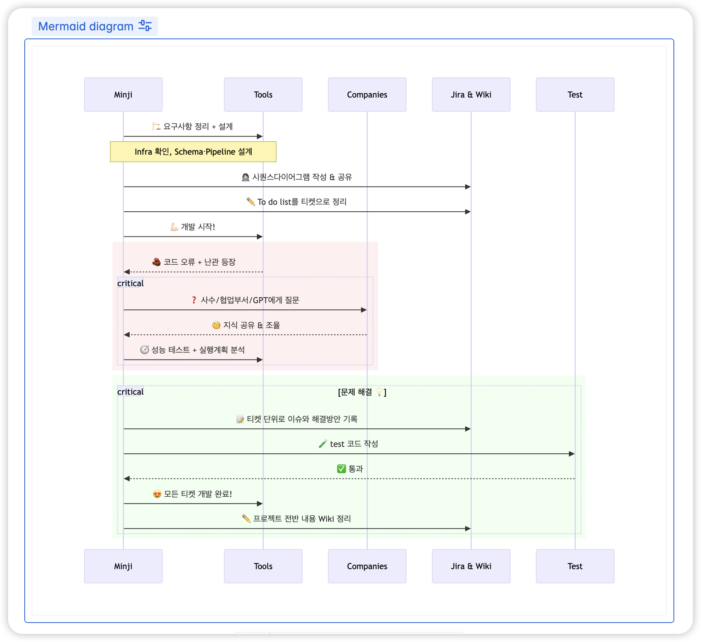

## 🦄 Welcome to Minji's Github 👋

  

<h2>✨ Skills ✨</h2>
<h3>🔧 Languages</h3>

<h3>🗂️ Frameworks</h3>

<h3>📈 Data Tools</h3>

<h3>🗃️ Database</h3>

<h3>☁️ Infrastructure</h3>

<h3>🛠️ Tools</h3>

<h3>🐾️ Docs</h3>

<h3>👩🏻‍💻 I'm studying ...</h3>

 
 
 
 
 
 
 
 

    

## 📬Contact

<!--
**minngki/minngki** is a ✨ _special_ ✨ repository because its `README.md` (this file) appears on your GitHub profile.

Here are some ideas to get you started:

- 🔭 I’m currently working on ...
- 🌱 I’m currently learning ...
- 👯 I’m looking to collaborate on ...
- 🤔 I’m looking for help with ...
- 💬 Ask me about ...
- 📫 How to reach me: ...
- 😄 Pronouns: ...
- ⚡ Fun fact: ...
-->
